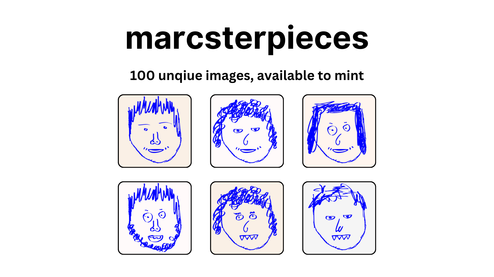

Marcsterpieces (marc-masterpieces) is a decentralized application (dApp) that allows users to mint unique digital art pieces as non-fungible tokens (NFTs). There are currently 100 images on the IPFS. Built with Solidity, React, and Web3.js, this project showcases the integration between a smart contract and a user-friendly frontend interface.

## Features

- **NFT Minting**: Users can mint new NFTs with unique digital art pieces by interacting with the smart contract through the web interface.
- **Ownership Verification**: The smart contract ensures that each digital art piece is uniquely owned by a single address.
- **Ether Transactions**: Supports transactions in Ether for minting NFTs, with a fixed price per mint.
- **Frontend Interface**: A React-based web application that provides a user-friendly interface for minting and viewing NFTs.

## Getting Started

These instructions will get you a copy of the project up and running on your local machine for development and testing purposes.

### Prerequisites

- [Node.js](https://nodejs.org/en/) (v12.x or higher)
- [npm](https://www.npmjs.com/) (v6.x or higher)
- [MetaMask](https://metamask.io/) extension installed in your browser
- An Ethereum wallet with some Ether (for deploying contracts and minting NFTs)

### Installation

1. Clone the repository:

```bash
git clone https://github.com/marcbeep/marcsterpieces.git
cd mp
```

2. Install NPM packages for the smart contract:

```bash
npm install
```

3. Compile and deploy the smart contract (Make sure you have configured Hardhat in your project):

```bash
npx hardhat compile
npx hardhat run scripts/deploy.js --network localhost
```

4. Start the React application:

```bash
npm run dev
```

5. Connect your MetaMask wallet to the application and switch to the hardhat network (or any other network you've deployed your contract to).

## Usage

After setting up the project and running the React application, navigate to the web interface to interact with the Marcsterpiece NFT collection.

- **Minting NFTs**: Choose an available digital art piece from the grid and click the "Mint" button to mint your NFT.
